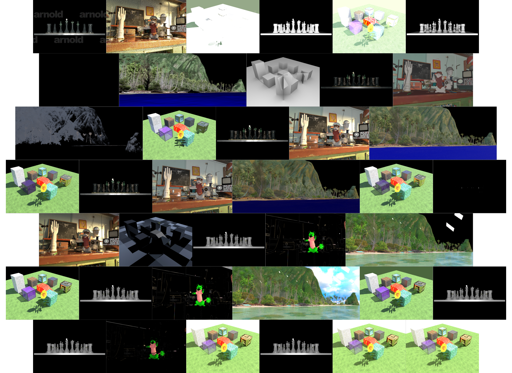

# USD Render Benchmark

`usd-render-benchmark` is a testing and benchmarking suite for evaluating various Hydra render delegates using Universal Scene Description (USD) scene files. This project aims to help developers and users of Hydra renderers identify performance and output differences across different renderers when rendering the same set of USD scenes.



## Table of Contents

- [Features](#features)
- [Setup](#setup)
- [Usage](#usage)
- [Repository Structure](#repository-structure)

## Features

- Support for multiple renderers, including Karma, Renderman, Arnold, Moonray, Cycles, and more.
- Automated rendering of predefined USD scenes with corresponding cameras.
- Generation of a summary report of rendering times, memory usage, and render success status.
- Support for rendering image sequences and single images.

## Setup

### Prerequisites

- Ensure you have the required renderers installed on your system!

- **Rez**: Ensure that Rez is installed and properly configured on your system. Rez is a package management system that manages environments for different software configurations, including renderers. You can find more information and installation instructions for Rez [here](https://github.com/AcademySoftwareFoundation/rez).

- **Rez Packages for Renderers**: The `usd-render-benchmark` repository includes a `packages` directory containing example Rez package definitions for various renderers. These packages serve as examples and may need to be adapted to match your specific site configuration, particularly the paths to renderer installations, which are often site-specific.

    - You should customize the provided Rez package definitions to reflect the paths and environment settings of the renderers installed on your system. For instance, make sure the `PATH`, `PYTHONPATH`, `PXR_PLUGINPATH_NAME`, and other relevant environment variables are set correctly in the Rez package definitions.

    - After configuring these packages, you should be able to run commands such as:

      ```
      rez env houdini -- usdrecord --renderer "Karma CPU" ...
      rez env moonray -- usdrecord --renderer "Moonray" ...
      ```

      These commands will activate the appropriate environment for each renderer, ensuring that the `usdrecord` tool can recognize and use the specified Hydra render delegate.

### Clone the Repository

Clone this repository and its submodules:

```
git clone --recurse-submodules https://github.com/nicolaspopravka/usd-render-benchmark.git
cd usd-render-benchmark
```

### Extra Downloads

Before running the benchmark, you need to download and set up the necessary USD scene files:

1. **Moana Island Scene (Disney Animation):**

   Download the Moana Island USD scene provided by Disney Animation:

   - URL: [Moana Island USD v2.1](https://datasets.disneyanimation.com/moanaislandscene/island-usd-v2.1.tgz)

   Extract the contents of the `island-usd-v2.1.tgz` file into the `scenes` directory (parallel to ALab):

   ```
   cd scenes
   tar -xvzf ~/Downloads/island-usd-v2.1.tgz --transform='s|^island|MoanaIsland|'
   ```

2. **ALab Scene (Animal Logic):**

   Download the extra downloadable packages provided by Animal Logic, for example:

   - URL: [ALab TechVars v2.2.0](https://dpel-assets.aswf.io/usd-alab/alab-techvars.v2.2.0.zip)

   Merge the downloaded package with the existing scenes/ALab Git submodule:
   
   ```
   cd scenes
   unzip ~/Downloads/alab-techvars.v2.2.0.zip -d ALab
   ```

   For detailed instructions, please refer to the [ALab GitHub repository](https://github.com/DigitalProductionExampleLibrary/ALab).

## Usage

### Running the Benchmark

To execute the rendering benchmarks, run the following command:

```
./render_script.sh
```

The `render_script.sh` script will:

1. Iterate through predefined renderers and scene/camera combinations.
2. Render each scene using each renderer and store the image in the `renderers/` directory.
3. Log rendering times, memory usage, and status to the `logs/` directory.

After rendering the images, generate a summary report:

```
python generate_render_summary.py --system-specs ...
```

The `generate_render_summary.py` script will create a `render_summary.md` file with the rendering times, memory usage, and success or failure status for each combination of renderer and scene.

## Repository Structure

```
usd-render-benchmark/
│
├── README.md                         # This README file
├── render_script.sh                  # Main script to run rendering benchmarks
├── generate_render_summary.py        # Script to generate a summary report from logs
├── renderers/                        # Output directory for rendered images
│   ├── Karma_CPU/
│   │   ├── island.jpg
│   │   └── ...
│   ├── Prman/
│   │   ├── chess_set.jpg
│   │   └── ...
│   └── ...
├── logs/                             # Directory containing log files for each render
│   ├── Karma_CPU_island.log
│   ├── Prman_chess_set.log
│   └── ...
├── render_summary.md                 # Generated summary report from logs
├── assets/                           # Directory containing USD assets (as a Git submodule)
│   ├── McUsd/
│   ├── OpenChessSet/
│   └── ...
├── scenes/
│   ├── MoanaIsland/                  # Extracted Moana Island
│   │   └── usd/
│   │       └── island.usda
│   └── ALab/                         # ALab Git submodule and merged packages
│       └── ALab/
│           ├── entry.usda
│           └── ...
└── packages/                         # Directory containing Rez package definitions for renderers
    ├── moonray/
    │   └── 1.5.0.0/
    │       └── package.py            # Example Rez package for MoonRay 1.5
    └── ...                           # Additional directories for other renderers and dependencies
```
