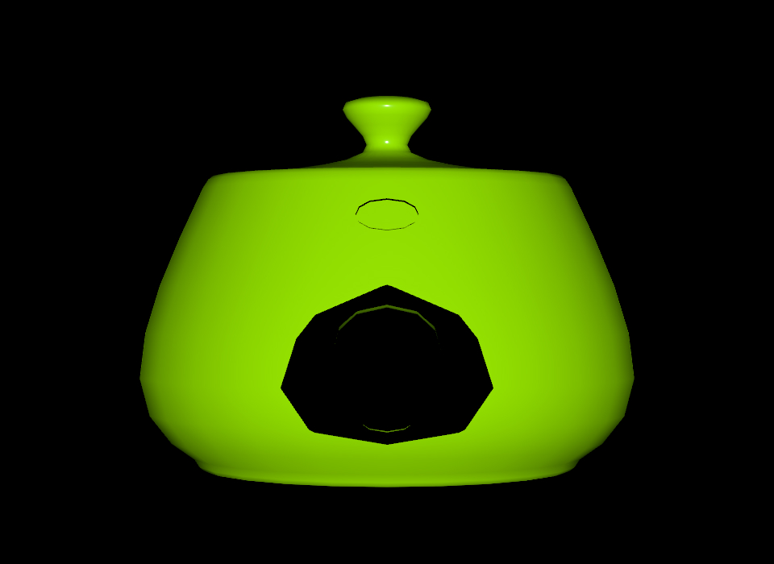

# USD Render Benchmark — `demo/run1`

This branch is a small end-to-end demonstration of the benchmark's mount-run
model.

It renders one scene with one Hydra render delegate:

- Renderer: GL (`HdStormRendererPlugin`)
- Scene: `assets/full_assets/Teapot/Teapot.usd`
- Camera: `main_cam`
- Output: `renderers/GL/Teapot.jpg`

The purpose is to show that a benchmark branch can be mounted into a reusable
container image, run without baking the branch into the image, and return its
logs, render, and summary to the host checkout.

It is not a renderer comparison, a performance result, or a claim that the
same environment supports the benchmark's other delegates and scenes.

## Result



| Item | Value |
| --- | --- |
| Workflow | [`run-demo` run 34244241519](https://github.com/nicolaspopravka/usd-render-benchmark-stack/actions/runs/34244241519) |
| Runnable image | `ghcr.io/nicolaspopravka/usd-render-benchmark:2026` |
| Process result | Success |
| Time | `0:02.04` |
| Maximum resident memory | `409740 KB` |
| Render | 960×700 JPEG |

The time and memory values describe one GitHub-hosted runner execution. They
should not be used as a performance comparison.

## Run through GitHub Actions

The workflow is maintained in
[`usd-render-benchmark-stack`](https://github.com/nicolaspopravka/usd-render-benchmark-stack):

```bash
gh workflow run run-demo.yml \
  --repo nicolaspopravka/usd-render-benchmark-stack \
  -f run_branch=demo/run1 \
  -f runnable_image=ghcr.io/nicolaspopravka/usd-render-benchmark:2026
```

The workflow:

1. Clones this branch and initializes its submodules.
2. Mounts the checkout at `/usr/local/usd-render-benchmark`.
3. Runs `render_script.sh` with Mesa software rendering under Xvfb.
4. Generates `render_summary.md` from the log on the host runner.
5. Uploads `logs/`, `renderers/`, and `render_summary.md`.

## Reproduce locally

The following uses a branch name and an image tag. Both can move.

```bash
git clone \
  --branch demo/run1 \
  --single-branch \
  --recurse-submodules \
  https://github.com/nicolaspopravka/usd-render-benchmark.git \
  run-branch

docker run --rm \
  --platform linux/amd64 \
  -v "$PWD/run-branch:/usr/local/usd-render-benchmark" \
  -w /usr/local/usd-render-benchmark \
  --entrypoint bash \
  ghcr.io/nicolaspopravka/usd-render-benchmark:2026 \
  -c 'dnf install -y mesa-dri-drivers mesa-libEGL libepoxy &&
      LIBGL_ALWAYS_SOFTWARE=1 xvfb-run -a bash render_script.sh'

(cd run-branch && python3 generate_render_summary.py \
  --system-specs \
  "ghcr.io/nicolaspopravka/usd-render-benchmark:2026")
```

The container writes directly into the mounted checkout. A rerun is therefore
expected to update:

- `logs/GL_Teapot.log`
- `renderers/GL/Teapot.jpg`
- `render_summary.md`
