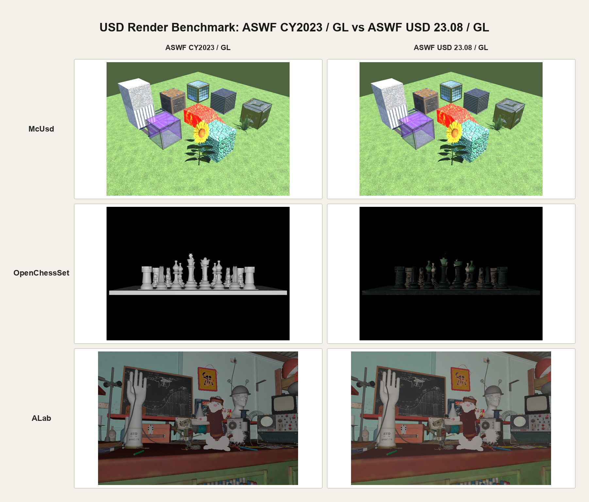

# ASWF CY2027 / Embree Render Benchmark

This branch records a partial Embree 4.3.3 run using the ASWF CY2027
environment and OpenUSD 26.08. It is not a complete CY2027 rerun of the original benchmark.

## Run configuration

- Renderer: Hydra Embree
- USD: OpenUSD 26.08
- Container: `ghcr.io/nicolaspopravka/usd-render-benchmark-embree:cy2027`
  (pinned by digest `sha256:51635d187c1e6938227a024b3b87d5552fc41a794c5bcce734dc8d4499d80ec2`)
- GPU: NVIDIA L4, 24 GB
- Driver: NVIDIA 580.126.20
- OS: Rocky Linux 9.8

Stock `usdrecord` creates a GL context via Qt/PySide, which requires a display
server. [`tools/usdrecord_egl.py`](tools/usdrecord_egl.py) replaces this with
direct EGL initialization via ctypes, enabling headless GPU-accelerated
rendering. The Rez USD package (`packages/usd/26.08/package.py`) redirects the
`usdrecord` command to this wrapper via `alias("usdrecord", ...)`.

## Results

The results are in [`render_summary.md`](render_summary.md).

Rendered images are under [`renderers/Embree/`](renderers/Embree/). Complete
logs are under [`logs/`](logs/).
