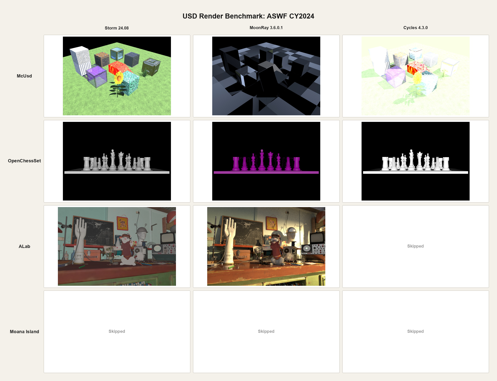

# ASWF CY2027 / Cycles Render Benchmark

This branch records a partial Cycles 5.2.0 run using the ASWF CY2027 environment
and OpenUSD 26.05. It is not a complete CY2027 rerun of the original benchmark.

## Run configuration

- Renderers: Cycles 5.2.0
- OpenUSD: 26.05
- Container: `ghcr.io/nicolaspopravka/usd-render-benchmark-cycles@sha256:4b4a2023fdb69816afaee1a2dd526dade7577b30d76e42e206926bdf93374afa`
- GPU: NVIDIA RTX PRO 6000 Blackwell Server Edition, 96 GB
- Driver: NVIDIA 595.91.07
- OS: Rocky Linux 9.8

## Results

The results are in [`render_summary.md`](render_summary.md). Rendered images are under [`renderers/Cycles/`](renderers/Cycles/). Complete logs are under [`logs/`](logs/).
