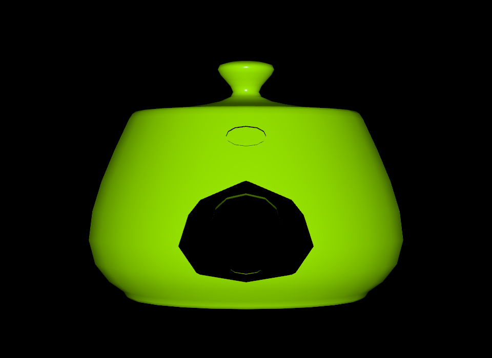

# USD Render Benchmark — `demo/run1`

This branch records one Storm render of Teapot using a mounted benchmark
checkout and a reusable container image. It demonstrates the benchmark's
mount-run model with software rendering.

## Run configuration

- Renderers: Storm
- OpenUSD: Not recorded
- Container: `ghcr.io/nicolaspopravka/usd-render-benchmark:2026@sha256:6d35b1c7db7e04387b6999f0e688d8612f33fd6b6f3e1e0aaa202fe2f65dd4d5`
- GPU: None (software rendering)
- Driver: Mesa 23.1.4-4.el8_10
- OS: Rocky Linux 8

## Results

The results are in [`render_summary.md`](render_summary.md). Rendered images are under [`renderers/GL/`](renderers/GL/). Complete logs are under [`logs/`](logs/).
